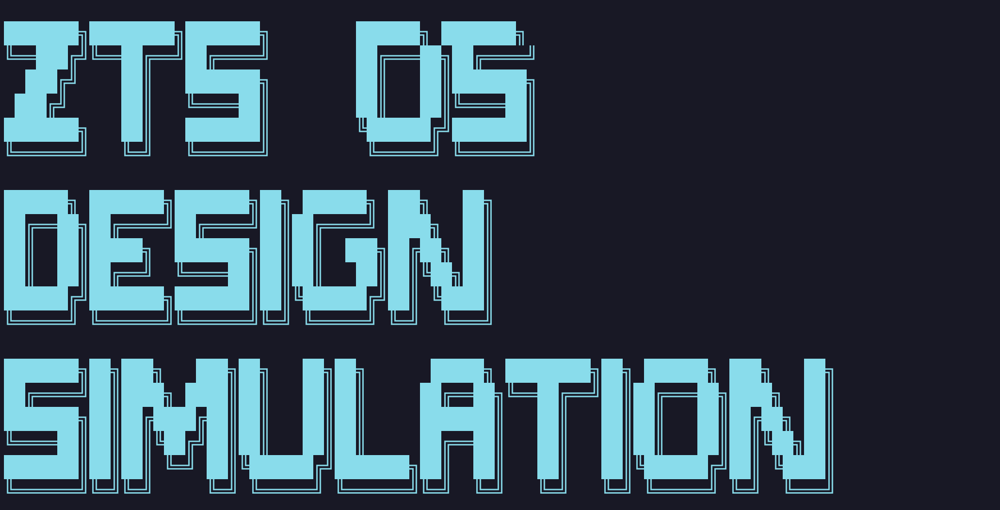

# 操作系统设计与仿真平台设计大作业
## ZTS Operating System Design & Simulation Platform

   *🚀 基于 C++17 构建的操作系统模拟算法平台*

   [](https://github.com/your-repo/ZTS_OS_Design)
   [](https://www.microsoft.com/windows)
   [](https://isocpp.org/)
   [](https://cmake.org/)
   [](LICENSE)

   []()
   []()
   []()
   []()


## 🌟 项目概述

   ZTS OS Design 是一个**操作系统算法仿真平台**，通过交互式演示和实时可视化将理论操作系统概念变为现实。基于现代 C++17 构建。
   <div align="center">
      
   </div>

> (纯作业)


## ✨ 核心特性

<table>
   <tr>
   <td width="50%">

   ### 🔧 **进程调度算法 Process Scheduling**
   - **FCFS** - 先来先服务 (First Come First Served)
   - **Round Robin** - 时间片轮转调度  
   - **SJF/SRTF** - 最短作业优先 (非抢占/抢占式)
   - **Priority** - 优先级调度 (非抢占/抢占式)
   - **实时可视化**演示，逐步执行过程
   - **性能指标分析** (等待时间、周转时间、CPU利用率)

   </td>
   <td width="50%">

   ### 💾 **内存管理 Memory Management**
   - **连续分配算法** (首次适应、最佳适应、最坏适应、循环首次适应)
   - **分页系统** 页表管理
   - **页面置换算法** (FIFO、LRU、LFU、Clock)
   - **内存碎片分析**与可视化
   - **虚拟内存仿真**
   - **动态内存可视化**与实时统计

   </td>
</tr>
<tr>
<td width="50%">

### 📁 **文件系统 File System** *(计划中)*
- **层次化目录**结构管理
- **文件分配方法** (连续、链式、索引)

</td>
<td width="50%">

### 🔄 **进程同步 Process Synchronization** *(计划中)*
- **信号量与互斥锁** Semaphores & Mutexes
- **经典同步问题** (生产者-消费者、读者-写者)

</td>
</tr>
</table>


## 🚀 快速开始

### ⚡ 一键安装运行

```bash
# 克隆仓库 Clone Repository
git clone https://github.com/your-username/ZTS_OS_Design.git
cd ZTS_OS_Design

# 构建运行 (Windows)
.\scripts\build.bat
.\build\bin\ZTS_OS_Design.exe

# 或使用 CMake 直接构建
mkdir build && cd build
cmake .. -G "Visual Studio 16 2019" -A x64
cmake --build . --config Release
.\bin\ZTS_OS_Design.exe
```

### 🔧 环境要求

| 组件 Component | 版本 Version | 状态 Status |
|---------------|-------------|-------------|
| **Windows** | 10/11 (x64) | ✅ 必需 Required |
| **Visual Studio** | 2019+ | ✅ 必需 Required |
| **CMake** | 3.16+ | ✅ 必需 Required |
| **C++ 标准** | C++17 | ✅ 必需 Required |
| **PowerShell** | 5.0+ | ✅ 推荐 Recommended |


## 🎯 开发路线

### 🚀 **第一阶段：核心基础** ✅ 
- [x] 项目架构与构建系统
- [x] 专业启动界面与UI设计
- [x] 进程调度算法 (FCFS, RR, SJF, Priority)
- [x] 内存管理系统 (连续分配)
- [x] 交互式演示系统

### 🔥 **第二阶段：高级内存管理** ✅ 
- [x] 内存分配算法实现
- [x] 分页系统实现
- [x] 页面置换算法
- [x] 虚拟内存仿真
- [x] 内存可视化增强

### 🌟 **第三阶段：文件系统** ⏳ 
- [ ] 层次化目录结构
- [ ] 文件分配方法
- [ ] 磁盘调度算法
- [ ] 文件操作仿真

### 🎉 **第四阶段：进程同步** ⏳ 
- [ ] 信号量与互斥锁
- [ ] 经典同步问题
- [ ] 死锁检测与预防
- [ ] 多线程支持

### 🚀 **第五阶段：高级特性** ⏳ 
- [ ] 网络仿真
- [ ] 安全机制
- [ ] 性能分析
- [ ] Web界面支持


## 🛠️ 技术栈

<div align="center">

   **核心技术 Core Technologies**
   [](https://isocpp.org/)
   [](https://cmake.org/)
   [](https://www.microsoft.com/windows)

   **开发工具 Development Tools**
   [](https://visualstudio.microsoft.com/)
   [](https://git-scm.com/)
   [](https://docs.microsoft.com/powershell/)

</div>


## 🤝 贡献

热烈欢迎来玩！以下是您可以参与的方式：

<div align="center">

[](https://github.com/your-repo/issues)
[](https://github.com/your-repo/issues)
[](docs/)
[](https://github.com/your-repo/pulls)

</div>


**臭要星的来要⭐️辣！**

[](https://star-history.com/#your-username/ZTS_OS_Design&Date)


**Made with 💜 by ZTS | © 2025 ZTS Operating System Design**

